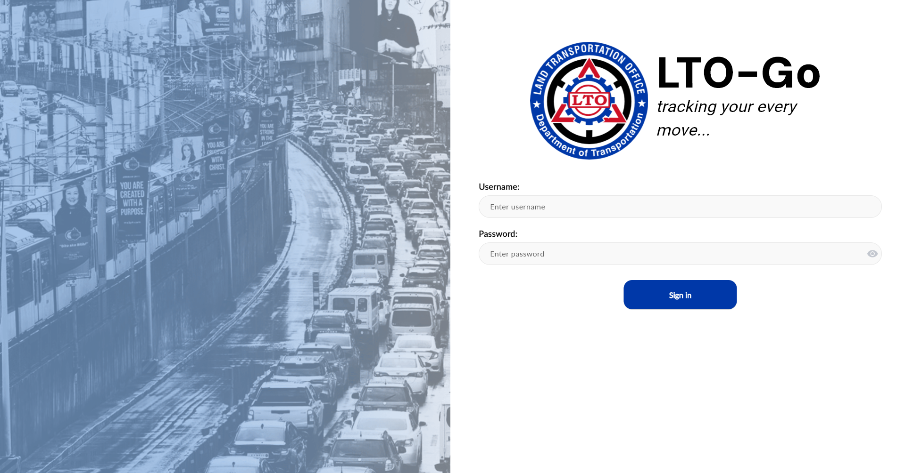
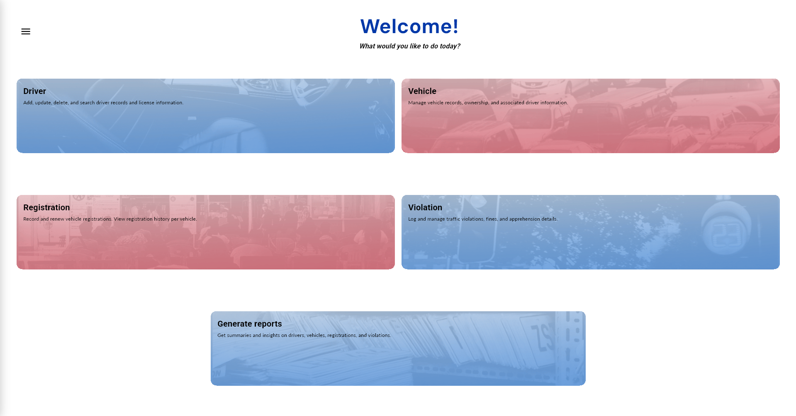
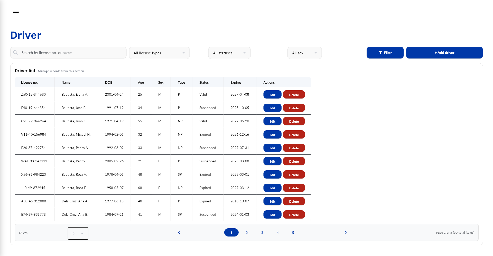
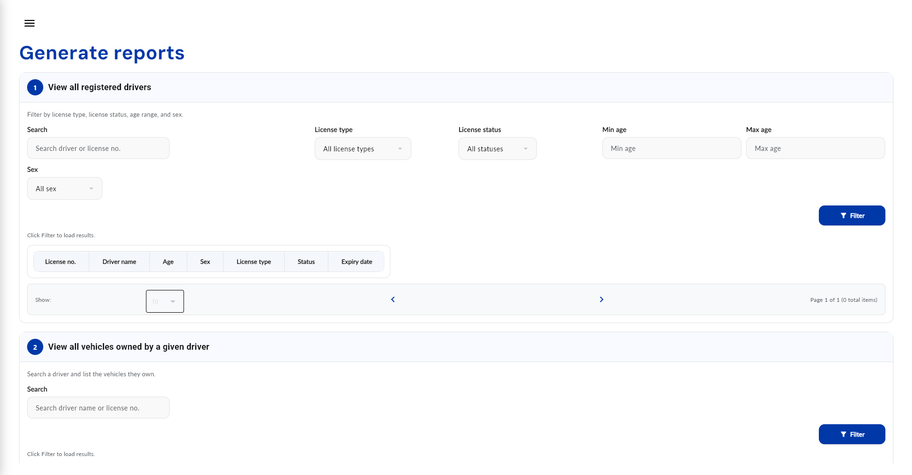

 # 🚗💨 LTO-Go: Supporting LTO Operations

LTO-Go is a comprehensive Land Transportation Office (LTO) management system built in Python. The application system aims to simulate a simplified version of real world LTO operations.

## 🚦 About The Project

LTO-Go features a full suite of administrative capabilities for transportation management:
- **Driver Management:** Create, read, update, and delete (CRUD) driver records, including demographic data, license details, and complete address information.
- **Vehicle Management:** Register and maintain vehicle records, linking them securely to their corresponding registered owners.
- **Vehicle Registration Management:** Manage vehicle registrations, track issue and expiry dates, and monitor active, expired, or suspended statuses.
- **Traffic Violation Management:** Record and track traffic violations, linking them to specific vehicles and drivers, while tracking fines, apprehension officers, and location data.
- **Reporting & Analytics:** Generate robust filtered reports for data analysis, including:
  - Viewing registered drivers by license type, status, age range, and sex.
  - Viewing all vehicles owned by a specific driver.
  - Identifying vehicles with expired registrations as of a specific date.
  - Identifying drivers with expired or suspended licenses.
  - Tracking traffic violations within a date range for a specific driver.
  - Aggregating total violations by type per year.
  - Viewing all vehicles involved in violations within a given city or region.

## 📸 Screenshots

| Sign In | Home |
|---------|------|
|  |  |

| Driver Management | Generate Reports |
|-------------------|------------------|
|  |  |

## 🔧 Stack

- **Frontend/UI:** [Flet](https://flet.dev/) - A framework that enables building interactive, modern multi-platform UIs entirely in Python.
- **Database:** PostgreSQL
- **Database Driver:** `psycopg2` - PostgreSQL database adapter for Python.

## ⚙️ Prerequisites

Before running the application, ensure you have the following installed:
1. Python 3.8 or higher
2. PostgreSQL (running locally on port `5432`)
3. Required Python packages: `flet`, `psycopg2`

## How to Run

1. **Install Dependencies:**
   Open your terminal and install the required Python packages:
   ```bash
   pip install flet psycopg2
   ```
   *(Note: You may need `psycopg2-binary` depending on your operating system).*

2. **Database Configuration:**
   Ensure your local PostgreSQL server is running. The application expects the following default PostgreSQL credentials to create and connect to the database:
   - Host: `localhost`
   - Port: `5432`
   - User: `postgres`
   - Password: `useruser`

   *(Note that PostgreSQL settings may vary per user. You may need to change the settings inside the .py files depending on your setup.)*

3. **Initialize the Database:**
   Run the database setup script to automatically create the `lto-go` database, configure the schema, and seed it with over 50 rows as the example data set for the tables:
   ```bash
   python setup_database.py
   ```

4. **Launch the Application:**
   Start the application by running the Flet application through sign_in.py
   ```bash
   flet run sign_in.py
   ```

   You can log in to the application using the default seeded credentials:
   - **Username:** `admin.lto@gov.ph`
   - **Password:** `endthesem`
